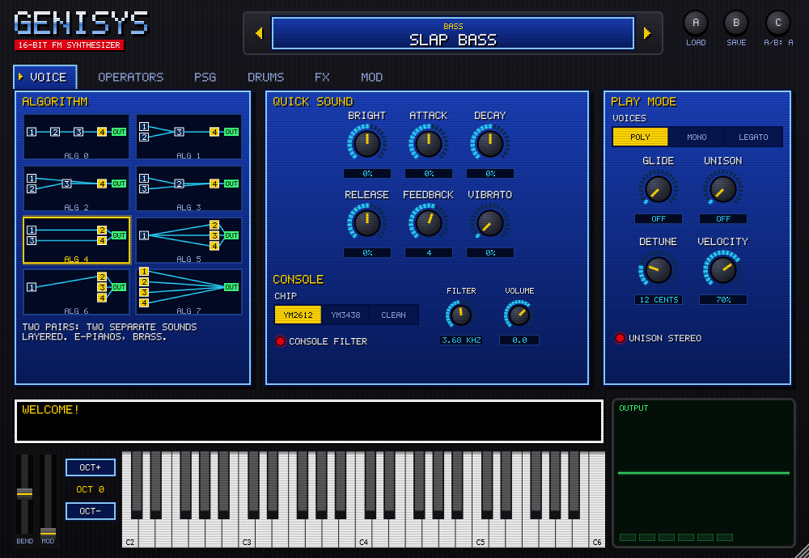
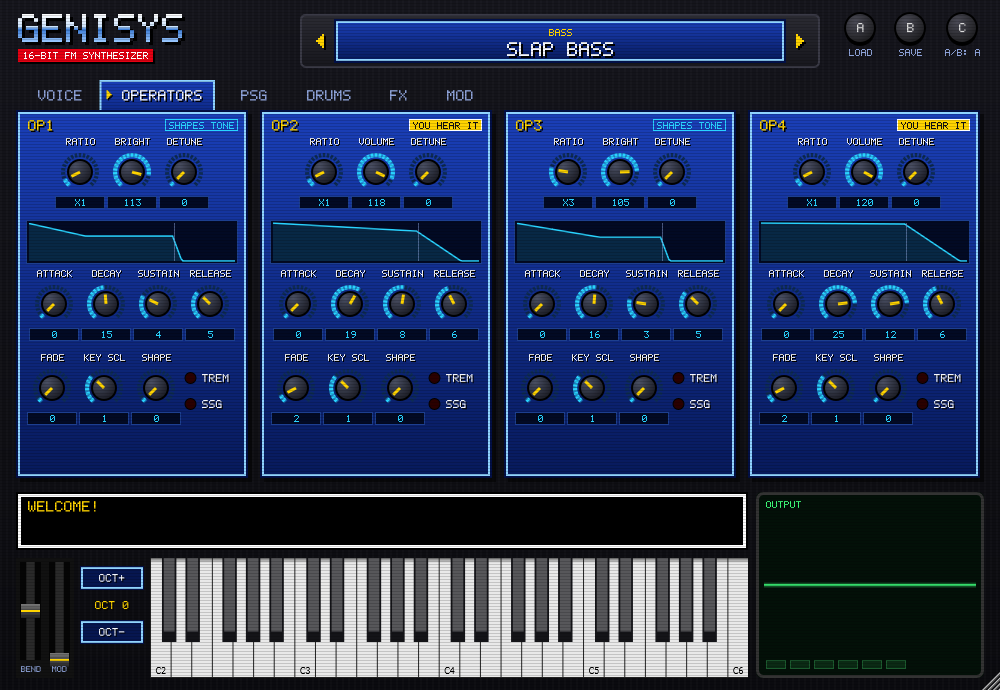

# Genisys

A synthesizer for the sound of 16-bit console FM music. It's built on a cycle-accurate emulation of the **Yamaha YM2612** FM chip and the **SN76489** square-wave chip, wrapped in a front panel inspired by 16-bit game menus.



It comes as a **VST3** plugin (Windows, macOS, Linux), an **AU** plugin (macOS, for Logic and GarageBand) and a **Standalone app** that needs no DAW.

> **Status: beta.** Things may change between versions. See the [roadmap](docs/ROADMAP.md).

## Download

Go to the **[Releases page](../../releases/latest)** and download the zip for your computer:

| Your computer | Download | Inside the zip |
|---|---|---|
| Windows 10/11 (64-bit) | `Genisys-Windows.zip` | `Genisys.vst3`, `Genisys.exe` |
| macOS 10.13+ (Intel or Apple Silicon) | `Genisys-macOS.zip` | `Genisys.vst3`, `Genisys.component`, `Genisys.app` |
| Linux (64-bit) | `Genisys-Linux.zip` | `Genisys.vst3`, `Genisys` |

Unzip it first. The plugin files are folders (`Genisys.vst3`, `Genisys.component`), so always copy the **whole folder**.

## Install the plugin for your DAW

### Windows
1. Copy the `Genisys.vst3` folder into `C:\Program Files\Common Files\VST3\`. Windows will ask for administrator permission; click **Continue**.
2. Open your DAW and rescan plugins (see the DAW notes below).
3. Add **Genisys** to an instrument track. You'll find it under instruments, by "Kris Cagle".

### macOS
1. Copy `Genisys.vst3` into `~/Library/Audio/Plug-Ins/VST3/`.
   - In Finder, press **Cmd+Shift+G** and paste the path.
   - For **Logic** or **GarageBand**, also copy `Genisys.component` into `~/Library/Audio/Plug-Ins/Components/`.
2. The builds aren't signed with an Apple developer certificate yet, so macOS may say the plugin "can't be opened". To allow it, open **Terminal** and run:
   ```bash
   xattr -dr com.apple.quarantine ~/Library/Audio/Plug-Ins/VST3/Genisys.vst3 ~/Library/Audio/Plug-Ins/Components/Genisys.component
   ```
3. Open your DAW and rescan plugins.
   - **Logic Pro:** if Genisys shows as failed, open **Logic Pro → Settings → Plug-in Manager**, select Genisys and click **Reset & Rescan Selection**.
   - **Ableton Live:** in **Settings → Plug-Ins**, turn on **Use Audio Units v2** and/or **Use VST3 Plug-In System Folders**, then **Rescan**.

### Linux
1. Copy `Genisys.vst3` into `~/.vst3/` (create the folder if it doesn't exist).
2. Rescan plugins in your DAW (Reaper, Bitwig and Ardour all support VST3).

### Rescanning in popular DAWs
| DAW | How to make it find Genisys |
|---|---|
| Ableton Live | Settings → Plug-Ins → turn on **Use VST3 Plug-In System Folders** → **Rescan** |
| FL Studio | Options → Manage plugins → **Find more plugins** |
| Reaper | Preferences → Plug-ins → VST → **Re-scan** |
| Bitwig | Settings → Locations → Plug-ins → it rescans automatically |
| Studio One | Options → Locations → VST Plug-Ins → **Reset Blocklist / Rescan** |
| Logic / GarageBand (Mac) | Uses the AU (`Genisys.component`). Restart Logic; it checks new plugins on launch. |

## Run the Standalone app (no DAW needed)

- **Windows:** double-click `Genisys.exe`. If SmartScreen warns that the app is unrecognised, click **More info → Run anyway**. This happens because the build isn't code-signed.
- **macOS:** move `Genisys.app` to Applications. The app isn't signed with an Apple developer certificate yet, so macOS blocks it the first time. Do one of these:
  - Run `xattr -dr com.apple.quarantine /Applications/Genisys.app` in Terminal, or
  - try to open it once, then go to **System Settings → Privacy & Security** and click **Open Anyway**. On macOS 14 and earlier, **right-click → Open** also works.
- **Linux:** run `./Genisys` (you may need `chmod +x Genisys` first).

**Using a MIDI keyboard with the Standalone:** click **Options** (top-left) → **Audio/MIDI Settings**, then tick your keyboard under **Active MIDI inputs**. You can also choose your audio output there. Without a keyboard, click the on-screen piano or use your computer keys (see below).

## Quick tour



- **Pick a sound:**
  - There are 66 presets in 12 categories.
  - Use the **◀ ▶** arrows on the cartridge, or click its label for the full list.
- **Hover for help:**
  - The black text box at the bottom explains whatever your mouse is over.
- **Knobs:**
  - Drag up or down to turn, and hold **Shift** for fine control.
  - The mouse wheel steps a knob, and **double-click** resets it.
- **Tabs:**
  - **VOICE:** the algorithm, Quick Sound shaping and play mode.
  - **OPERATORS:** the four FM operators in detail.
  - **PSG:** the square-wave layer and arpeggio.
  - **DRUMS:** the drum kit.
  - **FX:** chorus, echo and reverb.
  - **MOD:** LFO, vibrato and pitch bend.
- **Quick Sound:**
  - BRIGHT, ATTACK, DECAY and RELEASE reshape any preset without needing to know FM.
  - Setting them back to 0 returns the preset to how it was made.
- **Playing without a MIDI keyboard:**
  - Click the on-screen piano, or play **A W S E D F T G Y H U J K** on your computer keyboard.
  - **Z / X** shift the octave.
  - **BEND** and **MOD** are on-screen wheels.
- **Drums:**
  - Turn on **Drums On** (DRUMS tab), then play MIDI channel 10 (kick on C2, snare on D2, closed hat on F♯2, and so on).
  - You can also click the pads, or switch on **Keys Play Drums**.
- **Patches:**
  - **A** loads community Genesis patches (`.tfi`, `.vgi`, `.dmp`).
  - **B** saves your sound as `.tfi`.
  - **C** flips between two versions of a sound so you can compare edits.

## Something not working?

- **No sound in the Standalone:**
  - Check **Options → Audio/MIDI Settings** and make sure an output device is selected.
- **The DAW doesn't list Genisys:**
  - Make sure you copied the whole `Genisys.vst3` folder, not just what's inside it, into the VST3 folder for your system.
  - Then rescan plugins.
- **Mac says the plugin is damaged or can't be opened:**
  - Run the `xattr` command from the macOS install steps.
- **Something sounds odd after opening the app:**
  - The Standalone remembers your last settings. Pick a preset to start fresh.

## What's inside

- **YM2612 FM core** (`synth-core/`)
  - all 8 algorithms and operator-1 feedback
  - the real envelope generator and rate tables
  - SSG-EG, LFO (vibrato and tremolo), detune, and channel-3 special mode
  - written in plain C with no OS dependencies
- **SN76489 PSG core:** 3 square-wave channels plus periodic/white noise.
- **Engine** (`engine/`): the layer every front-end shares.
  - 6-voice allocation, with oldest-voice stealing that doesn't cut off release tails
  - MIDI note and velocity handling
  - patch application
  - a band-limited resampler that converts the chip's native ~53 kHz output to any host sample rate
- **The console's sound path:**
  - the YM2612's 9-bit DAC and its gritty "ladder effect" (switchable to the cleaner YM3438 or a fully clean output)
  - a Model 1-style output filter
- **Drum kit on MIDI channel 10:**
  - 8-bit kick, snare, clap and tom samples played through FM channel 6's DAC, as Genesis games did. They're synthesized, not recorded.
  - hi-hats and cymbals on the PSG noise channel
- **PSG layer:** the square-wave channels can double your FM notes or play a chiptune arpeggio, with envelopes that step at 60 Hz like the original sound drivers.
- **Playing:** velocity, pitch bend, mod-wheel vibrato and sustain pedal; Poly, Mono and Legato modes with glide; stereo Unison; an Octave shift.
- **Effects:** chorus, echo (tempo-synced, ping-pong) and reverb.
- **Patch files:** load community Genesis patches (`.tfi`, `.vgi`, `.dmp`) and save your sounds as `.tfi`.
- **Demo renderer** (`tools/genisys_render`): writes demo WAVs, so you can hear the engine without a DAW.
- **Desktop app** (`desktop/`, Windows): the original raylib prototype, kept for reference. The plugin's Standalone app replaces it.
- **Nintendo DS port** (`nds/`): proof that the core runs on real, constrained hardware.

## Building

Requires CMake 3.22+, a C11 compiler, and for the plugin a C++17 compiler: MSVC 2022 on Windows, Xcode/Clang on macOS, or GCC/Clang on Linux. CMake downloads JUCE 9.0.2 automatically, pinned to a verified checksum.

```bash
cmake -B build -DCMAKE_BUILD_TYPE=Release
cmake --build build --config Release
ctest --test-dir build -C Release --output-on-failure
```

Plugin files end up in `build/plugin/Genisys_artefacts/Release/`.

Options:

| Option | What it builds |
|---|---|
| `-DGENISYS_BUILD_PLUGIN=OFF` | skip the JUCE plugin (on by default, except with MinGW) |
| `-DGENISYS_BUILD_UI_SNAPSHOT=ON` | `genisys_ui_snapshot`: renders every editor tab to PNG |
| `-DGENISYS_BUILD_DESKTOP=ON` | raylib desktop app (Windows with MinGW/GCC, needs raylib from MSYS2) |
| `-DGENISYS_BUILD_PC_DEMO=ON` | miniaudio test-tone demo (Windows) |

## Project layout

```
synth-core/   chip emulation (YM2612, SN76489): platform-independent integer C
engine/       voices, patches, MIDI, resampling: shared by every front-end
plugin/       the JUCE plugin (VST3 / AU / Standalone)
tests/        unit tests for the cores and the engine, run through CTest
desktop/      raylib prototype app
pc/           headless test-tone demo
nds/          Nintendo DS port (devkitPro, built separately)
docs/         roadmap and design notes
```

## Credits

The YM2612 envelope-rate, detune and key-code tables are reverse-engineered hardware timing data. They come from the lineage of MAME's YM2612 core (Jarek Burczynski, Tatsuyuki Satoh), refined by Eke-Eke for Genesis Plus GX using Nemesis's and Sauraen's hardware research. See the header of `synth-core/src/ym2612.c`.

## Third-party

- [JUCE](https://juce.com) 9 (AGPLv3), which includes the Steinberg VST3 SDK.

## License

Genisys is free software under the [GNU General Public License v3.0](LICENSE). You can use, share and modify it. If you distribute a modified version, you must also share its source code under the same license.
